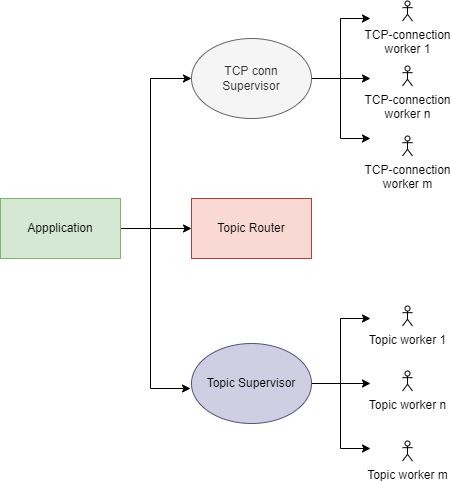
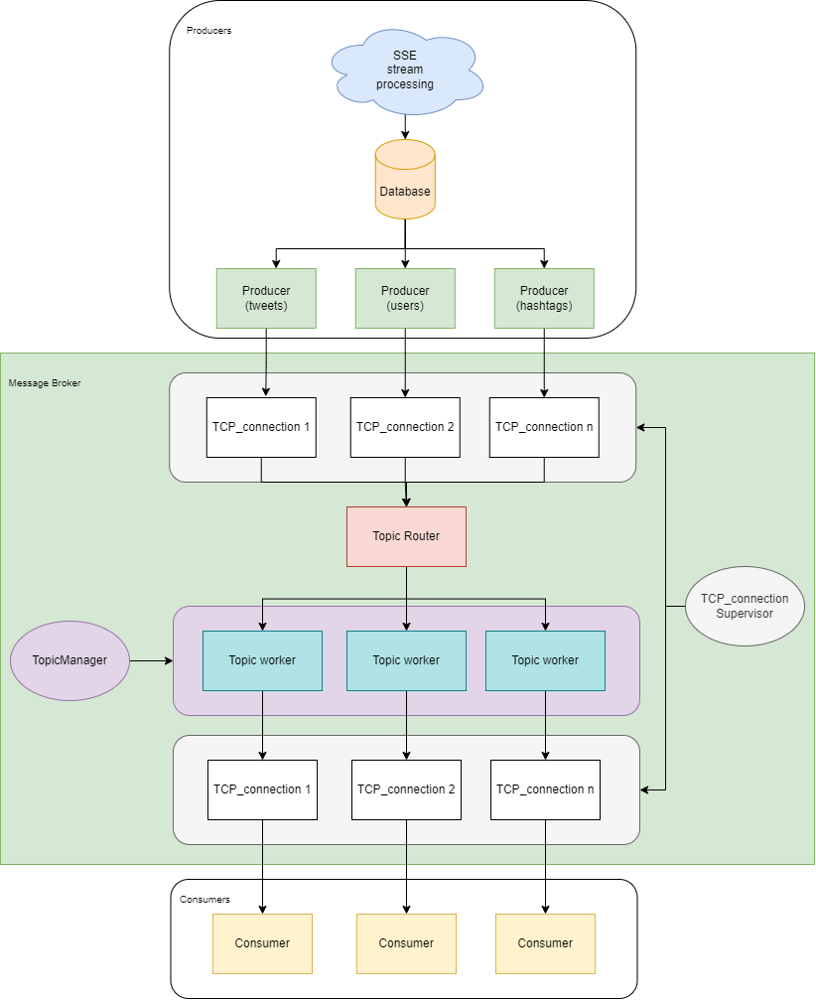
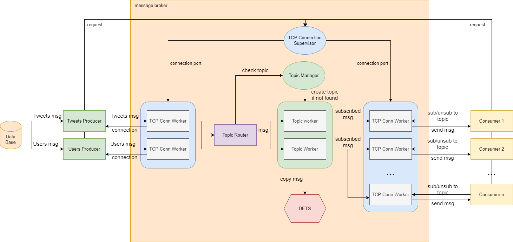
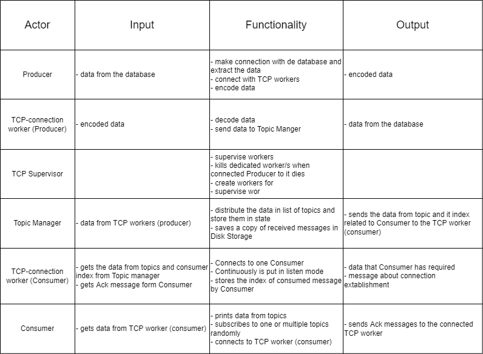

## Task
The task for this laboratory work is to create a message broker that would manage communication between producers and consumers.
The message broker should have support for multiple topics and have the possibility to subscribe and unsubscribe dynamically. The applications should be deployed
in docker containers and started together using docker compose.

## Checkpoint #1
### Application Supervision Tree
Here is the diagram of the supervision tree for the application.  
Mainly, there will be one main Top Supervisor, which will be the Application/Docker, and 2 Pool Supervisors that will manage Topic workers and TCP workers.    

### System Architecture Diagram
Diagram showcasing the architecture, clouds representing higher level abstractions  

### Data Flow
Data flow diagram showcasing the supervision inside worker pools  

### Actors' Endpoints

